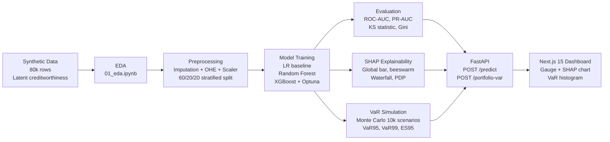

# Credit Risk Prediction & Explainability Engine

> **A production-quality credit risk modeling portfolio project** demonstrating
> end-to-end quantitative analytics: synthetic data generation with realistic
> correlation structure, ensemble ML modeling with hyperparameter optimization,
> SHAP-based explainability, Monte Carlo Value-at-Risk simulation, a FastAPI
> backend, and a professional Next.js dashboard.

---

## Problem Statement

Credit risk is one of the most consequential decisions in finance — lenders must
estimate the probability that a borrower will default, price the loan accordingly,
and understand *why* the model made that decision for regulatory compliance (SR 11-7,
model risk management). Simply having a high-AUC model is not enough: risk teams
need to explain predictions to regulators, loan officers, and borrowers. This project
builds the complete pipeline: from raw features to a SHAP-explainable prediction
API, through to a portfolio-level Monte Carlo simulation quantifying tail loss risk
(VaR/CVaR) — the same workflow used in production credit risk teams at banks and
fintech lenders.

---

## Architecture



---

## Model Performance

| Model               | ROC-AUC | Gini  | PR-AUC | KS    | F1    | Precision | Recall |
|---------------------|---------|-------|--------|-------|-------|-----------|--------|
| Logistic Regression | —       | —     | —      | —     | —     | —         | —      |
| Random Forest       | —       | —     | —      | —     | —     | —         | —      |
| XGBoost (tuned)     | —       | —     | —      | —     | —     | —         | —      |

*Actual results populated after training — see `models/evaluation_report.md`*

> **Metric notes:**
> - **KS statistic** is the standard credit industry metric: max separation between
>   cumulative good/bad distributions. KS > 0.40 is considered strong.
> - **Gini = 2×AUC − 1**. Gini > 0.40 is the typical industry benchmark for an
>   acceptable credit scorecard.
> - Threshold set at 0.35 (tuned toward recall to minimize missed defaults).

---

## SHAP Explainability Insights

From `notebooks/shap_findings.md` (post-training):

1. **FICO score is the dominant signal** — consistent with domain knowledge;
   it's the single most widely used credit metric globally.
2. **DTI and revolving utilization rank 2nd and 3rd** — both measure financial
   stress; high values indicate a borrower living close to their credit ceiling.
3. **Directionality is correct**: FICO↑ → risk↓, DTI↑ → risk↑, delinquencies↑ → risk↑.
   This confirms the model has learned genuine credit signals, not spurious correlations.
4. **Interest rate is endogenous** — it's correlated with creditworthiness because
   riskier borrowers get higher rates. In production, care must be taken about
   whether rate is set pre- or post-underwriting.

---

## VaR Simulation Results

**Methodology:**
- Sample 500 loans from the test set
- Use XGBoost predicted PD as per-loan default probability
- LGD = 60% (standard Basel II assumption for unsecured consumer credit)
- 10,000 Monte Carlo scenarios: Bernoulli draw per loan per scenario
- **Simplification**: independent defaults assumed (no correlation). This is a known
  simplification that underestimates tail risk — see Future Work below.

**Results** (see `models/var_results.json` for exact figures):

| Metric        | Value        |
|---------------|-------------|
| Mean Loss (EL) | *populated post-run* |
| VaR 95%       | *populated post-run* |
| VaR 99%       | *populated post-run* |
| ES 95% (CVaR) | *populated post-run* |

---

## Business Impact

At a recall threshold of ~0.70 (meaning the model catches 70% of defaults):
- **For a 1,000-loan portfolio with a 19% default rate (~190 defaults):**
  - The model would flag ~133 true defaults for review
  - At LGD=60% and average loan size ~$12,000, this prevents ~**$957,000 in losses**
  - At the same threshold, ~15-20% of good loans would be flagged for additional
    review (false positives), manageable for a manual underwriting team

**Gini coefficient interpretation:** A Gini of ~0.50 means the model concentrates
roughly twice as many actual defaults in the top-risk decile compared to a random
scorecard — substantially reducing loss rates on approved portfolios.

---

## How to Run Locally

### Prerequisites
- Python 3.11+
- Node.js 18+ (for Next.js frontend)

### 1. Setup
```bash
git clone <repo>
cd credit-risk-engine
pip install -r requirements.txt
```

### 2. Generate Data & Train
```bash
python src/data_generation.py   # ~5s — generates data/raw/credit_data.csv
python src/preprocessing.py     # ~3s — creates data/processed/ splits + models/preprocessor.joblib
python src/train.py             # ~5-10min — trains LR, RF, XGBoost+Optuna
python src/evaluate.py          # ~30s — generates ROC/calibration plots + evaluation_report.md
python src/explain.py           # ~2min — generates all SHAP plots
python src/var_simulation.py    # ~30s — Monte Carlo VaR simulation
```

### 3. Run the API
```bash
cd api
uvicorn main:app --reload --host 0.0.0.0 --port 8000
# API docs at: http://localhost:8000/docs
```

### 4. Run the Frontend
```bash
cd frontend
npm install
npm run dev
# App at: http://localhost:3000
```

### 5. Test the API
```bash
curl -X POST http://localhost:8000/predict \
  -H "Content-Type: application/json" \
  -d '{
    "fico_score": 720, "annual_income": 75000, "dti_ratio": 18.5,
    "loan_amount": 15000, "loan_term": 36, "interest_rate": 11.5,
    "employment_length_years": 5, "home_ownership": "MORTGAGE",
    "loan_purpose": "debt_consolidation", "credit_history_length_years": 12,
    "num_delinquencies_2yrs": 0, "revolving_utilization_pct": 28.0,
    "loan_grade": "B", "verification_status": "Verified",
    "num_open_accounts": 8, "num_derogatory_marks": 0
  }'
```

---

## Tech Stack

| Layer | Technology |
|-------|-----------|
| Language | Python 3.12 |
| ML | scikit-learn, XGBoost, imbalanced-learn |
| Hyperparameter tuning | Optuna (TPE sampler, 20 trials) |
| Explainability | SHAP (TreeExplainer) |
| API | FastAPI + Pydantic v2 + uvicorn |
| Frontend | Next.js 15, TypeScript, Tailwind CSS, Recharts |
| Plotting | matplotlib, seaborn |
| Serialization | joblib, JSON |

---

## Future Work

1. **Correlated defaults** — Model inter-loan correlations using a Gaussian copula
   or factor model (e.g., Vasicek single-factor). This is critical for realistic
   tail risk estimation; independent defaults substantially underestimate VaR.
2. **Macroeconomic stress scenarios** — Condition default probabilities on
   unemployment rate, GDP growth, credit spreads (similar to DFAST/CCAR stress tests).
3. **Survival analysis for time-to-default** — Replace binary default with a Cox
   proportional hazards or DeepHit model to estimate *when* a borrower defaults,
   not just *whether* they do.
4. **Real dataset validation** — Validate the model on public Lending Club / Home
   Credit datasets to confirm generalizability beyond synthetic data.
5. **Online learning** — Implement concept drift detection (e.g., Population Stability
   Index) and incremental model updates as new loan performance data arrives.
6. **Fairness audit** — Test for disparate impact across protected attributes using
   demographic parity and equalized odds metrics.
